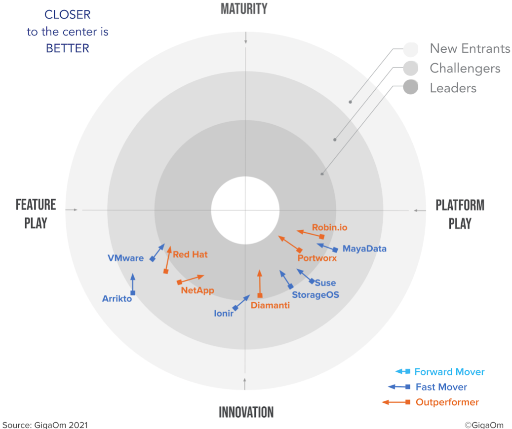
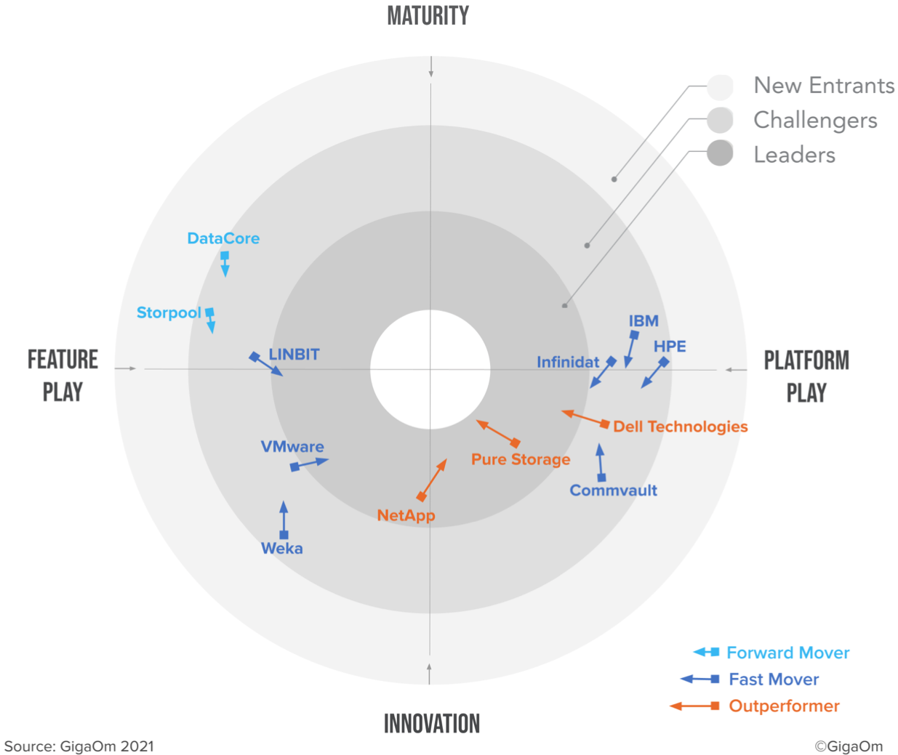
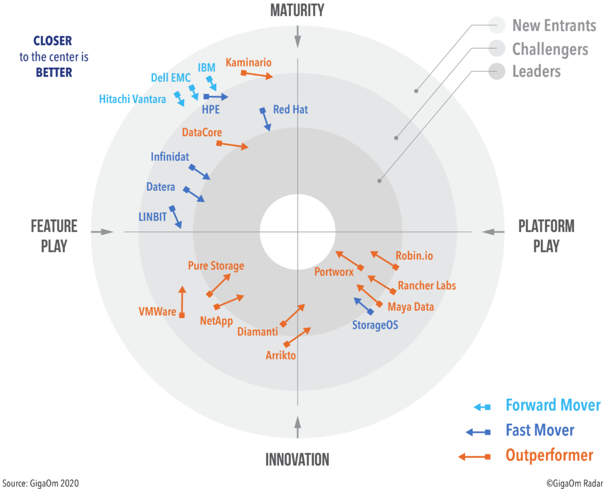

# Kubernetes CSI Storage Drivers

## Whast is this?
This repo wants to hold a list of Kubernetes CSI drivers and management solution for databases.  
At present the list considers:
- block storage
- distributed block storage
- snapshot & backup/restore capabilities
- UI, CLI and REST interfaces
- *dulcis in fundo*: performance :-)

## In an ideal world
I'd like to stress-test them all with a consistent series of tests and data use-cases and compare them. In practise I know it'll be impossible to test them all and follow them as they mature, new releases come to light and the market consolidates.
The idea is to have subdirectories with their names and within it, architecture details with reports on their UX, performance and management capabilities.

### The list
- [Arrikto Rok](https://www.arrikto.com/rok-data-management/)
- [Blockbridge](http://www.blockbridge.com/)
- [Ceph CSI](https://github.com/ceph/ceph-csi)
  - [Ceph FS](https://docs.ceph.com/en/latest/cephfs/)
- [Dell EMC](https://dell.github.io/storage-plugin-docs/)
  - [CSI driver for PowerFlex](https://github.com/dell/csi-powerflex)
  - [CSI driver for PowerScale](https://github.com/dell/csi-powerscale)
  - [CSI driver for PowerMax](https://github.com/dell/csi-powermax)
  - [CSI driver for PowerStore](https://github.com/dell/csi-powerstore)
  - [CSI driver for Unity](https://github.com/dell/csi-unity)
- [Hedvig](https://www.commvault.com/software-defined-storage)
- [Mayadata Kubera](https://mayadata.io/product)
- [NetApp Trident](https://netapp-trident.readthedocs.io/en/stable-v21.01/)
- [OpenEBS](https://openebs.io/)
- [Piraeus](https://piraeus.io/)
  - it manages [LINSTOR](https://github.com/LINBIT/linstor-server)
- [Pure Storage - Portworx](https://portworx.com/)
- [Rancher Labs Longhorn](https://longhorn.io/)
- [Robin](https://robin.io/)
- [Rook](https://rook.io/)
- [StorageOS / OnDat.io](https://storageos.com/features)
- [StorPool](https://storpool.com/kubernetes)
- [Virtuozzo](https://www.virtuozzo.com/)
- [Volumez](https://volumez.com/) 

# Storage Reports

## 2021 GigaOm
In 2021 GigaOm differentiated between **Cloud Native (CN)** CSI storage solutions and **Enterprise** CSI solutions. The reader is advised to read the full report in order to better understand the segmentation done.

### CN CSI Storage

[The 2021 GigaOm Radar *report* for **Cloud Native Kubernetes** CSI Data Storage](assets/2021_gigaom-radar-for-cloud-native-kubernetes-data-storage-1.pdf)

   

### Enterprise CSI Storage

[The 2021 GigaOm Radar *report* for **Enterprise** Kubernetes CSI Data Storage](assets/2021_gigaom-radar-for-enterprise-kubernetes-data-storage.pdf)

   
   

## 2020 GigaOm

[The GigaOm 2020 Radar report](assets/gigaom-radar-for-data-storage-for-kubernetes-2020.pdf)

